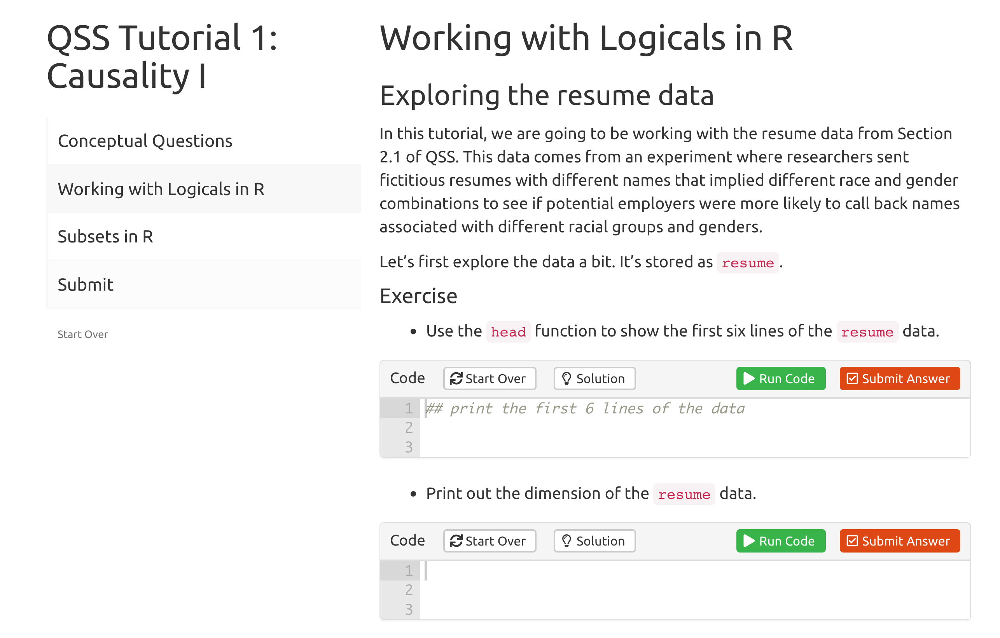

# qsslearnr: Interactive Tutorials for Quantitative Social Science

This package contains [`learnr`](https://rstudio.github.io/learnr/index.html) tutorials based on [*Quantitative Social Science: An Introduction*](http://qss.princeton.press/) by [Kosuke Imai](https://imai.fas.harvard.edu/) from Princeton University Press. To install this package, first install the `learnr` and [`gradethis`](https://github.com/rstudio-education/gradethis) packages:

``` r
remotes::install_github("rstudio-education/learnr")
remotes::install_github("rstudio-education/gradethis")
remotes::install_github("mattblackwell/qsslearnr")
```

Then you can start the tutorials in one of two ways. First, in RStudio 1.3 or later, you will find the QSS tutorials listed in the "Tutorial" tab in the top-right pane (by default). Find a tutorial and click "Run Tutorial" to get started. Second, you can run any tutorial from the R console by typing the following line: 

``` r
learnr::run_tutorial("00-intro", package = "qsslearnr")
```

This should bring up a tutorial in your default web browser. You can see the full list of tutorials by running:

``` r
learnr::run_tutorial(package = "qsslearnr")
```

The interface to the tutorials will look like this:




## Submission Reports

At the end of each tutorial, students can download submission reports that describe what questions and exercises they attempted. Students can then upload these PDFs to a learning management system like Canvas or Gradescope. 

## Other QSS tutorials

The material in these tutorials largely follows the original swirl course, [`qss-swirl`](https://github.com/kosukeimai/qss-swirl). 
